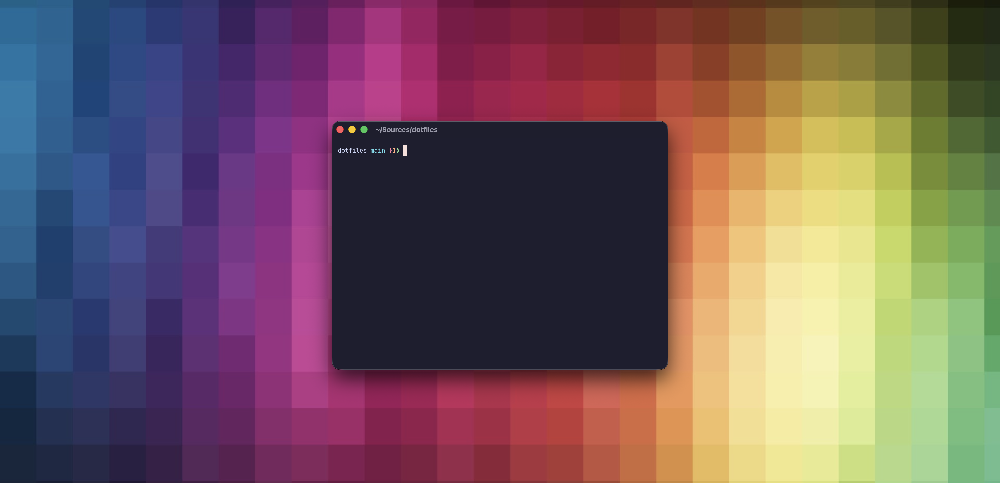

# dotfiles


## Stack
- **Terminal**: [Ghostty](https://ghostty.org)
- **Shell**: zsh
- **Prompt**: [Starship](https://starship.rs)
- **Plugins**: zsh-syntax-highlighting, zsh-autosuggestions, zsh-completions, zsh-history-substring-search, fzf

## Installation
```bash
git clone https://github.com/cgoldsby/dotfiles.git ~/Sources/dotfiles
cd ~/Sources/dotfiles && ./install.sh
```

For macOS system settings (dock, finder, wallpaper, dark mode):
```bash
./install.sh --macos
```

### What does the install script do?
- Installs Homebrew if missing
- Installs NVM if missing
- Installs via Homebrew: Ghostty, Starship, zsh plugins, fzf, rbenv, m-cli, mole (Mac deep cleaner)
- Installs Claude Code CLI via npm
- Symlinks `.zshrc`, `.shell_aliases`, `starship.toml`, Ghostty config
- Copies Ghostty icons to `~/.config/ghostty/`
- Configures vim
- Sets up git aliases (`git sl`)
- *(--macos)* Sets desktop wallpaper, dark mode, Finder and Dock preferences

## Manual Steps
- Copy GPG keys for GitHub
- Log in to Claude Code: `claude login`

## Migrating from zprezto
If coming from the old zprezto setup, remove it first:
```bash
rm -rf ~/.zprezto
rm -f ~/.zpreztorc ~/.zprofile ~/.zlogin ~/.zlogout ~/.zshenv
```

🌟 Special thanks to [@dcordero](https://github.com/dcordero) who inspired me to get my dotfiles affairs in order. Don't forget to checkout his [dotfiles](https://github.com/dcordero/dotFiles) setup.
